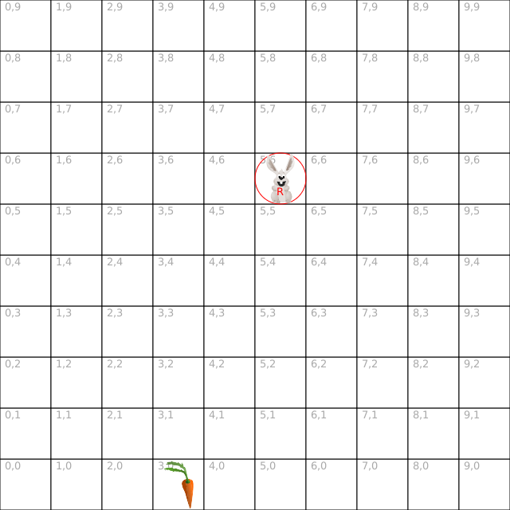
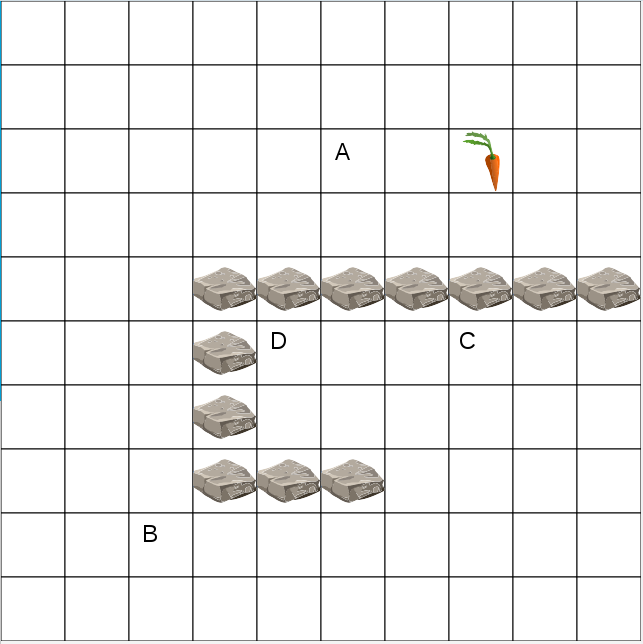

= Laapin - Exercices

== Introduction

Le plateau de jeu est constitué d'une grille divisée en cases:
[source,java]
----
int largeur = grille.taille.x; // <1>
int hauteur = grille.taille.y; // <2>
----
<1> Nombre de cases en largeur: 10 dans l'exemple
<2> Nombre de cases en hauteur: 10 dans l'exemple

On trouve dans les cases de cette grille, des lapins (toi ou un adversaire) et des carottes:
[source,java]
----
int monX = monLapin.coord.x; // <1>
int monY = monLapin.coord.y; // <2>
Coord coord = carotte.coord; // <3>
----
<1> Abscisse de mon lapin sur la grille: 5 dans l'exemple
<2> Ordonnée de mon lapin sur la grille: 5 dans l'exemple
<3> Coordonnées, c'est à dire _X,Y_, d'une carotte: 3,0 dans l'exemple

== Exercice 1: Les carottes

L'objectif est d'amener le lapin sur les carottes.

Pour celà, tu vas programmer l'intelligence de ton lapin:
[source,java]
----
public class RogerJoueur implements Joueur {
    public Action reflechir(Lapin monLapin, Grille grille) {
        // Met ton programme ici
    }
}
----

De temps en temps, le moteur du jeu vient demander au lapin ce qu'il souhaite faire:

- En paramètre:
    * `monLapin` contient les coordonnées de ton lapin
    * `grille` contient toutes les informations sur le plateau de jeu: position des carottes, position des lapins...
- En retour, `Action` contiendra l'action à effectuer. Par exemple:
    * `seReposer` pour ne rien faire
    * `avancer().enHaut()` pour se déplacer dans la case du dessus

Prenons un exemple:

[source,java]
----
Carotte carotte = grille.carotteProche(monLapin); // <1>
if (carotte == null) {                            // <2>
    return seReposer();
} else {
    if (carotte.estADroite().de(monLapin)) {      // <3>
        return avancer().aDroite();               // <4>
    }
}
----

<1> Récuperer la carotte la plus proche
<2> Lorsqu'il n'y a plus de carottes, `grille.carotteProche` retourne `null` (pas de carotte)
    et le lapin peut se reposer
<3> Tester si la carotte est à droite du lapin
<4> Si oui, déplacer le lapin d'une case à droite

Les premières règles du jeu:

- Un lapin ne peut pas quitter la grille
- Un lapin ne peut pas se trouver dans la même case qu'un autre lapin

Fait de même pour les autres cas: dirige ton lapin vers la carotte si elle est à gauche, en haut, en bas

    Participe à une compétition

<<<
== Exercice 2: Les autres lapins

L'objectif est de tirer partie de deux autres actions possibles. Le lapin peut:

- *Frapper* un autre lapin, le lapin assommé doit se reposer pendant 3 tours.
  Pour frapper un lapin, il doit être dans une cellule il doit être dans un cellule voisine.
[source,java]
----
return frapper().enHaut();
----
- *Sauter* par dessus un autre lapin, pour passer devant, et avancer ainsi de 2 cases au lieu d'une seule.
[source,java]
----
return sauter().aGauche();
----

Les règles du jeu supplémentaires:

- Ton lapin ne peut frapper ou sauter par dessus un autre lapin uniquement si celui-ci se trouve dans une case à côté
- Un lapin assommé ne joue pas pendant 3 tours.

Pour trouver le lapin le plus proche, c'est comme pour les carottes:
[source,java]
----
Lapin autreLapin = grille.lapinProche(monLapin);
----
Pour savoir à quelle distance il est de `monLapin`
[source,java]
----
int distance = monLapin.distance(autreLapin);
----
Pour savoir dans quelle direction il est de `monLapin`, et lui sauter par dessus:
[source,java]
----
Direction direction = monLapin.directionVers(autreLapin);
return sauter().vers(direction);
----
`direction` peut prendre les valeurs `HAUT`, `BAS`, `GAUCHeE`, `DROITE`

Pour savoir, s'il y a un autre lapin à droite:
[source,java]
----
Coord coordDroite = monLapin.coordVers(Direction.DROITE);
if (grille.contientLapin(coordDroite)) { ... }
----

En plus d'aller chercher les carottes, fait en sorte que ton lapin "s'occupe" des autres lapins. Libre à toi de choisir
l'action (avancer, frapper, sauter) en fonction de la situation (positions des carottes, positions des autres lapins).

    Participe à une compétition

<<<
== Exercice 3: Les rochers

On introduit un nouvel élément sur le plateau de jeu: les rochers.
L'objectif est d'essayer d'éviter les rochers, de les contourner...

Pour savoir, s'il y a un rocher en haut:
[source,java]
----
Coord coordHaut = monLapin.coordVers(Direction.HAUT);
if (grille.contientRocher(coordDroite)) { ... }
----

Pour savoir, s'il y a un obstacle (rocher, lapin ou bordure du terrain) à gauche:
[source,java]
----
Coord coordGauche = monLapin.coordVers(Direction.GAUCHE);
if (grille.contientObstacle(coordDroite)) { ... }
----

Les règles du jeu supplémentaires:

- Un lapin ne peut pas aller sur une case dans laquelle il y a un rocher
- Un lapin ne peut pas sauter par dessus un rocher

Essaye de tenir compte des rochers dans tes déplacements, essaye de les éviter.

<<<
== Exercice 4: L'algorithme

Dans la grille ci-dessus:

. Si un lapin est dans la case A, combien de pas doit-il faire pour arriver jusqu'à la carotte?
  Ecrire le résultat dans la case A.
. Si un lapin est dans la case B, quel est le plus court chemin qui mène à la carotte?
  - Ecrire le nombre de pas qu'il doit faire dans dans la case B.
  - Y a-t-il qu'un seul chemin pour aller de la case B à la carotte?
  - Tous les chemins ont-ils la même longueur?
. Même question pour les cases C et D, inscrire le nombre de pas dans la case correspondante.
. Quelles sont les cases à une distance de 1 pas de la carotte? De 2 pas? De 3 pas?
. Comment faire pour remplir rapidement toutes les cases de la grille avec la distance pour aller jusqu'à la carotte?
. Remplir les cases qui entourent (haut, bas, gauche, droite) les cases A/B/C/D avec la distance depuis cette case voisine jusqu'à la carotte
. Comment faire pour savoir dans quelle direction doit aller un lapin pour rejoindre au plus vite une carotte?

<<<
== Exercice 5: Le distancier

L'objectif est d'utiliser l'algorithme imaginé à l'étape précédente pour faciliter le contournement des rochers:

[source,java]
----
Distancier distancier = grille.distancierVers(carotte);     // <1>
int distance = distancier.distance(monLapin);               // <2>
Direction direction = distancier.directionDepuis(monLapin); // <3>
----

<1> Remplir la grille avec les distances pour aller jusqu'à la carotte.
    A l'issue de cette opération, `distancier` contient les distances pour aller vers la carotte en partant depuis n'importe quelle case du plateau.
<2> Retourne la distance pour aller jusqu'à la carotte à partir d'une case
<3> Détermine la (ou une) direction pour aller vers la carotte en empruntant le plus court chemin

Utilise le `Distancier` pour diriger le lapin vers les carottes en contournant les rochers.

    Participe à une compétition

